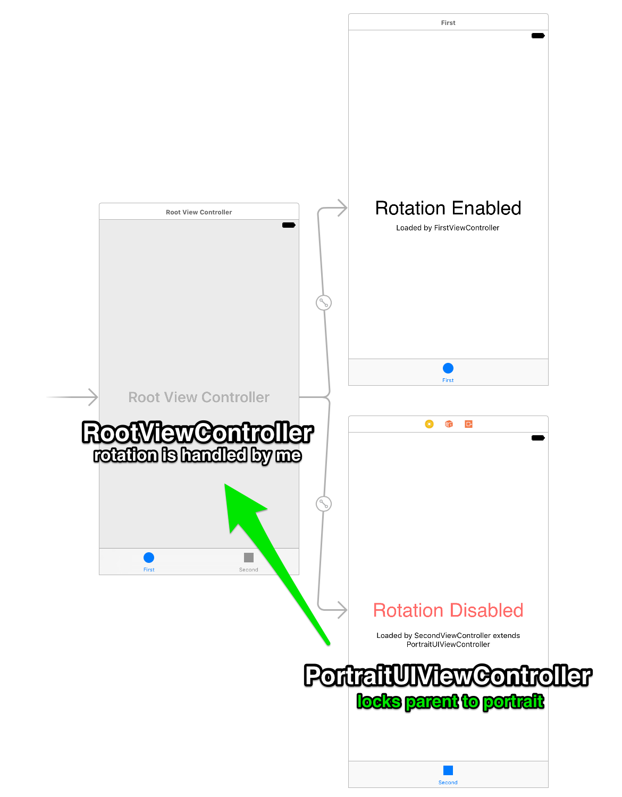

# RotationLockInTabbedViewChild

Solves the anoying issues with rotation lock.

## Explanation

### [RootViewController](RotationLockInTabbedViewChild/RootViewController.m)

Determines how next rotation will occure

### [PortraitUIViewController](RotationLockInTabbedViewChild/PortraitUIViewController.m)

Sets `nextOrientationMask` to Portrait on `viewDidAppear` and asks parent to reset the value on `viewDidDisappear`

### [SecondViewController](RotationLockInTabbedViewChild/SecondViewController.h)

Extends [PortraitUIViewController](RotationLockInTabbedViewChild/PortraitUIViewController.m) and nothing more

## License

[MIT](LICENSE.md) © [Gabriel Le Breton](https://gableroux.com)
